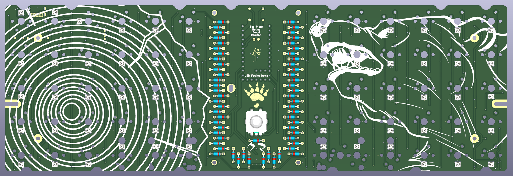
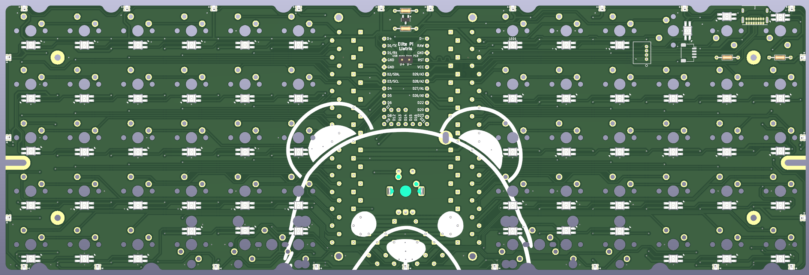
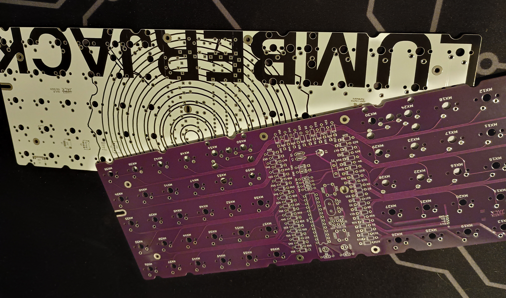

# Lumbearjack - Ortholinear 60% PCB based on Lumberjack by peej

Lumbearjack is a revision of peej's lumberjack with the following features:
* Pro Micro style controller support
* Per-key RGB and Backlight support
* Rotary encoder support
* SMD diode support
* BSS138 logic level shifter
  

Lumbearjack is currently designed with the following development boards:
* Helios
* Sea Picro
* Frood
* KB2040 (no encoder support)
  
With support for the following, but you may struggle with external USB data lines
* Liatris
* Elite-Pi

At its core, Lumbearjack remains easy to build with minimal soldering experience, but being familiar with soldering is highly recommended for per-key RGB (SK68XX Mini-E) and backlight (WS2812B 2020).

# Ordering parts

See the [Bill of materials](BOM.md) for a detailed list of the required parts.

PCBs can be manufactuered by a variety of online PCB fabricators. You can use [PCBShopper](https://pcbshopper.com/) to search for the best price.

The [zip file in the gerber directory](https://github.com/peej/lumberjack-keyboard/blob/master/gerber/lumberjack.zip) contains the gerber files your fabricator will need to make the PCB.

When uploading the gerber zip files, use the default PCB settings.

If you want to use a plate, there are [gerbers for FR4 plates](https://github.com/peej/lumberjack-keyboard/tree/smd-usbc/plates/gerbers). For the split plate, you will need two plates, one for each half of the keyboard.

# Construction

First, solder all the diodes on the top of the board. If you do not plan on using an encoder or a switch in the middle, you may omit the diode in the center of the board.
After you solder the diodes, solder the USB port on your board. From there, you may decide whether you would like to solder the LEDs or the controller to your board. It is recommended to solder the controller first so you may test your RGB as you solder them a few at a time.

See [the build guide](guide.md) for more information.

## Need help?

Feel free to create an issue request or contact me via discord at xsune for help!

# Firmware

Firmware is available in my [firmware repository](hyperlink)

Follow the [QMK firmware instructions](https://docs.qmk.fm/#/flashing) to build and flash the firmware.

(as of Rev 1.0, there is no onboard reset button. A reset button will be added to Rev 1.1.) 

## VIAL

Lumbearjack is compatible with Vial. You may follow the instructions for setting up a build environment [here](https://get.vial.today)
ZMK firmware will be added in the future

## Bootloader

 [See the build guide for more information](guide.md#bootloader).

## Matrix information

If you are building your own firmware, the following matrix information will be useful to you:

| Configuration   | Value                                  |
|-----------------|----------------------------------------|
| MATRIX_ROWS     | 12                                      |
| MATRIX_COLS     | 7                                     |
| MATRIX_ROW_PINS | X (GPX), X (GPX), X (GPX), X (GPX), X (GPX), |
| MATRIX_COL_PINS | X (GPX), X (GPX), X (GPX), X (GPX), X (GPX), |
| DIODE_DIRECTION | COL2ROW                                |

Lumbearjack uses an interleaved matrix to save a pin for RGB and a pin for the middle key so KB2040 users may still have access to most of the features. You must use an Elite-C style dev board for encoder support.

# Component cover

Cut a piece of 2mm thick acrylic to size (95x57mm) and drill 4 m2 holes in the corners for the standoffs. Use the PCB or cover.dxf as a guide for the hole positions, you can also use cover.dxf for laser cutting the correct size acrylic.

Affix the 4 standoffs to the PCB with screws from underneath the PCB. Use the remaining 4 screws to attach the acrylic to the top of the standoffs.

# Revisions

## Rev 1.0

* Initial design introduced

## Rev 1.1 plans:
* Make external USB data lines easier to solder for Elite-Pi and Liatris users.
* RGB strip support
* Adjust some LED placements and switch orientations
* Add Reset Button
* Possibly revise the logic level shifter
